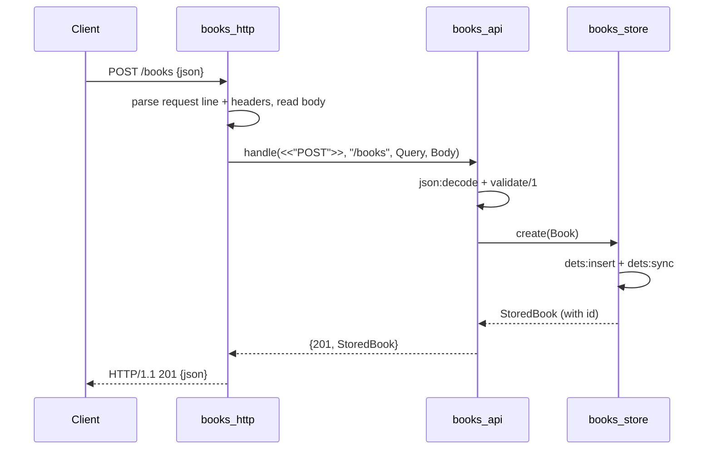

# Flow

A request to `POST /books` is read off the socket by `books_http:conn/1` (packet mode `http_bin`), which extracts the method, path, query and body, then calls `books_api:handle/4`. The API layer decodes the JSON body, runs `validate/1` (rejecting blank `title`/`author` with `400` and a `details` list), and on success calls the `books_store` gen_server, which persists the record to DETS with an auto-incremented id and syncs to disk. The stored book is serialised back with `json:encode` and returned as `201 Created`. The server is fully dependency-free — HTTP parsing, JSON (OTP 27+ `json` module) and storage (DETS) all use the standard library. Each connection is handled in its own spawned process; connections are kept alive unless `Connection: close` is sent.
