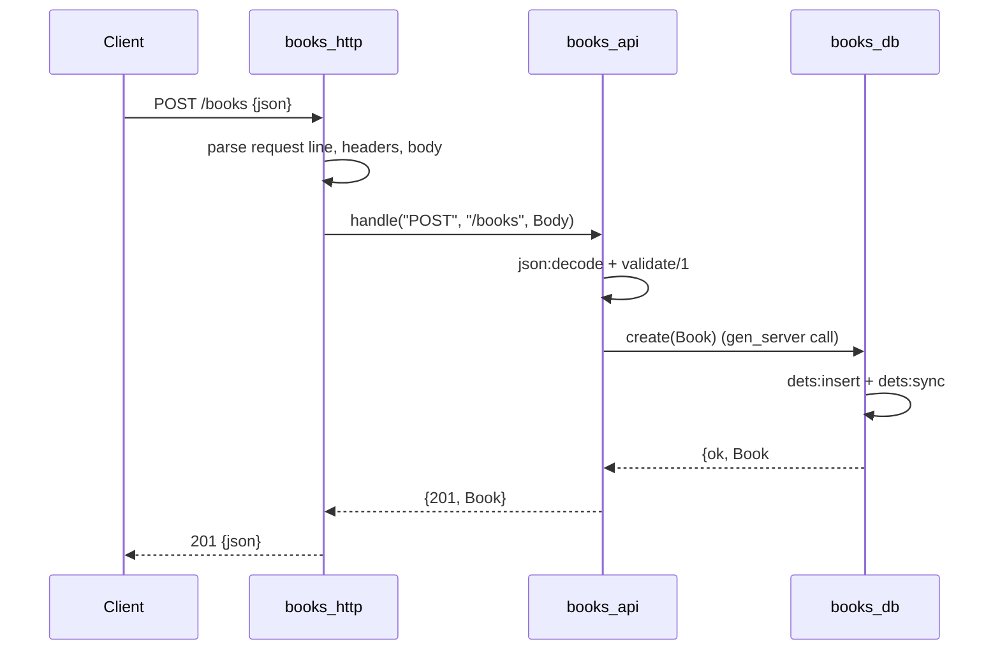

# Flow

A request is parsed by `books_http:handle_conn/1` using `gen_tcp` with `{packet, http_bin}`,
then dispatched to `books_api:handle/3`, which splits the path/query and routes. For a create,
the body is `json:decode`d and passed through `validate/1` (title and author are required
non-empty strings; year must be an integer if present; isbn a string if present). On success the
validated book is inserted into DETS via the `books_db` gen_server, which assigns an integer id
and `dets:sync`s to disk, then the book is JSON-encoded with a 201. Handler exceptions are caught
in `books_http:safe_handle/3` and returned as 500. Note: DETS is used as the embedded store in
place of SQLite (a deliberate, README-documented choice to stay dependency-free).
