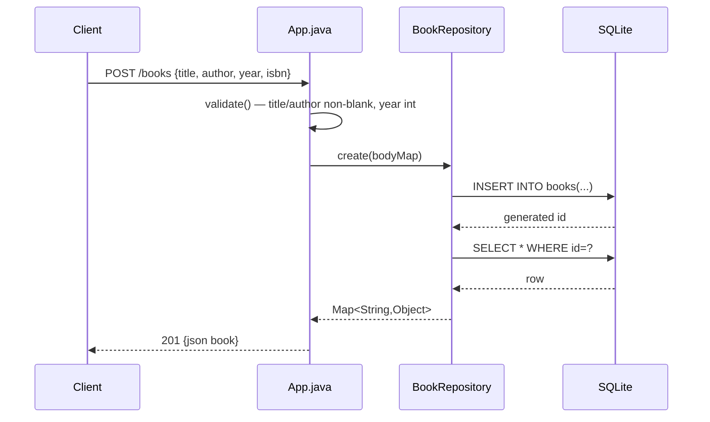

# Flow

A `POST /books` request is decoded by Jackson into a `Map`, validated (`App.java:64` — `title`/`author` must be non-blank strings, `year` an integer if present, else `400 {errors}`), then persisted by `BookRepository.create` which inserts and re-selects the row to return the full record including its generated `id`. Each repository call opens its own JDBC connection (`conn()`), and every method is `synchronized`, so writes are serialized at the process level. Errors are funnelled through a single `handle()` wrapper that maps uncaught exceptions to `500` and serializes all bodies as JSON. Trailing slashes are stripped before routing (`App.java:34`); a non-numeric `{id}` yields `404`.
