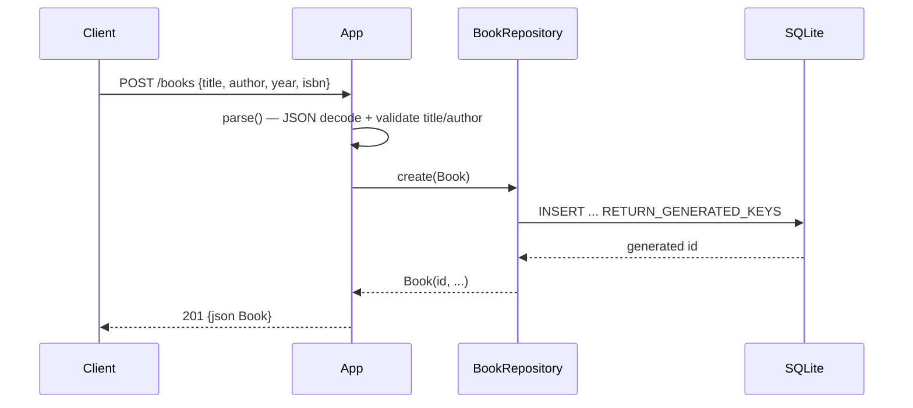

# Flow

A `POST /books` request is decoded by Jackson into a `Book` record and validated: a null/blank `title` or `author` short-circuits to `400 {errors:[...]}` before any DB access. On success `BookRepository.create` opens a fresh JDBC connection, inserts the row, reads the generated key, and returns the persisted `Book`, which `handle()` serializes to JSON with a `201`. Each repository method opens and closes its own connection and is `synchronized`; validation is limited to required-field presence (no ISBN/year format checks).
