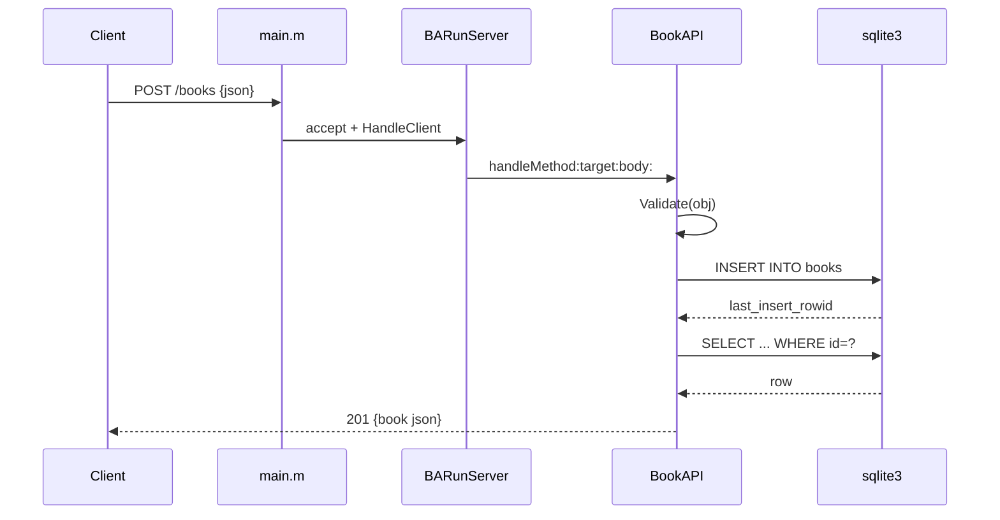

# Flow

A `POST /books` request is read by the minimal HTTP server (`HandleClient`), which parses the request line and `Content-Length`, then dispatches to `BookAPI -handleMethod:target:body:`. The body is JSON-parsed and passed through `Validate()`, which enforces non-blank `title`/`author` and type checks on `year` (integer, boolean rejected) and `isbn` (string). On success the row is inserted into SQLite and the freshly-fetched book is returned as `201`. Connections are handled serially inside a single accept loop because the SQLite handle is single-threaded (`BookAPI.m:192`). No pagination; author filtering is exact-match; each connection serves exactly one request then closes.
