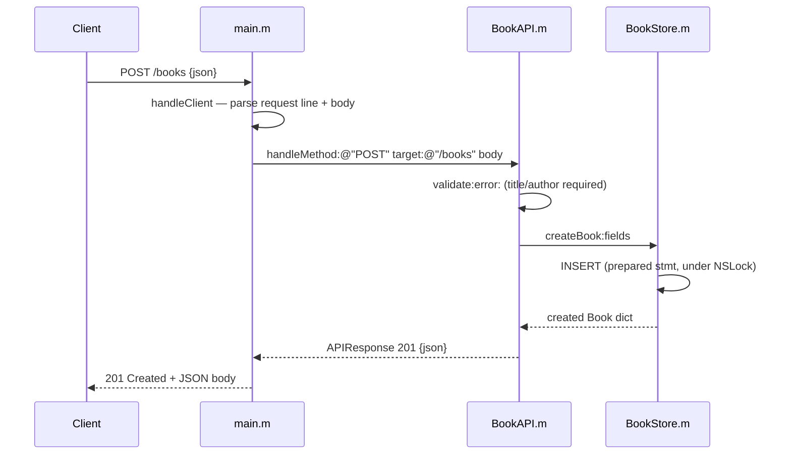

# Flow

A POST to `/books` is read off the socket by `handleClient`, which splits headers from body at `\r\n\r\n` and honours `Content-Length`. The parsed method/target/body are passed to `BookAPI.handleMethod:`, which routes on the path, validates that `title` and `author` are non-empty strings (and `year` an integer / `isbn` a string if present), then calls `BookStore.createBook:` — a prepared `INSERT` guarded by an `NSLock`, followed by a fetch of the new row. The result is serialized with `NSJSONSerialization` and written back as an HTTP/1.1 `201 Created`. Each connection is handled on a global dispatch queue with its own `@autoreleasepool`. Input validation and error handling (400/404/405/413) are present throughout.
