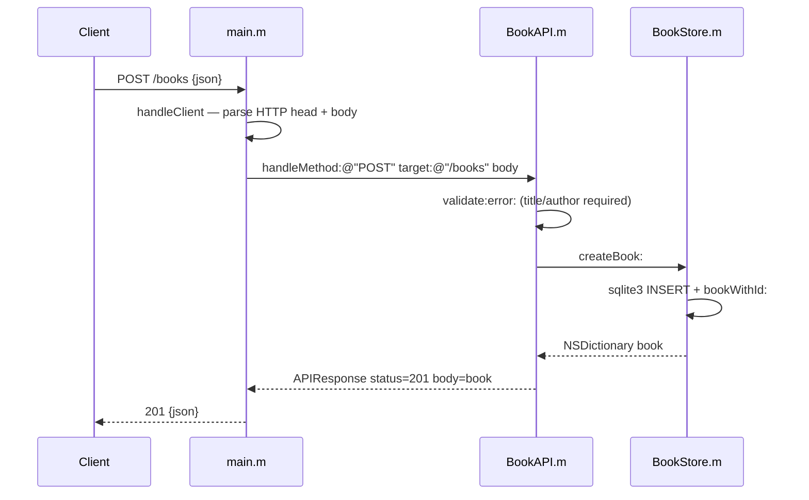

# Flow

A request to `POST /books` is read off the socket by `handleClient` in `main.m`, which splits the HTTP head from the body using the `Content-Length` header (bodies over 1 MiB are rejected with 413). The method, target, and body are handed to `BookAPI:handleMethod:target:body:`, which routes on the path components. For a create it calls `validate:error:` — rejecting a missing/blank `title` or `author`, a non-integer `year`, or a non-string `isbn` with 400 — then persists via `BookStore:createBook:` using parameterized `sqlite3` statements, and returns the stored row as a 201 JSON response. Input is validated; SQL uses bound parameters (no injection); the server is single-threaded with a `Connection: close` accept loop.
