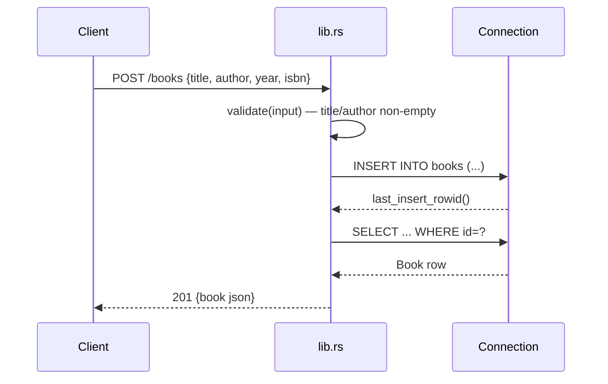

# Flow

A `POST /books` request is deserialized into `BookInput`, then `validate()` trims and checks that `title` and `author` are non-empty (returning 400 with a JSON `error` listing missing fields otherwise). The handler locks the shared `Arc<Mutex<Connection>>`, inserts the row, re-fetches it by `last_insert_rowid()`, and returns it as `201 Created` JSON. All DB access is serialized through a single mutex-guarded connection (synchronous rusqlite calls inside async handlers). Errors from rusqlite map to `500` with the error message in JSON.
