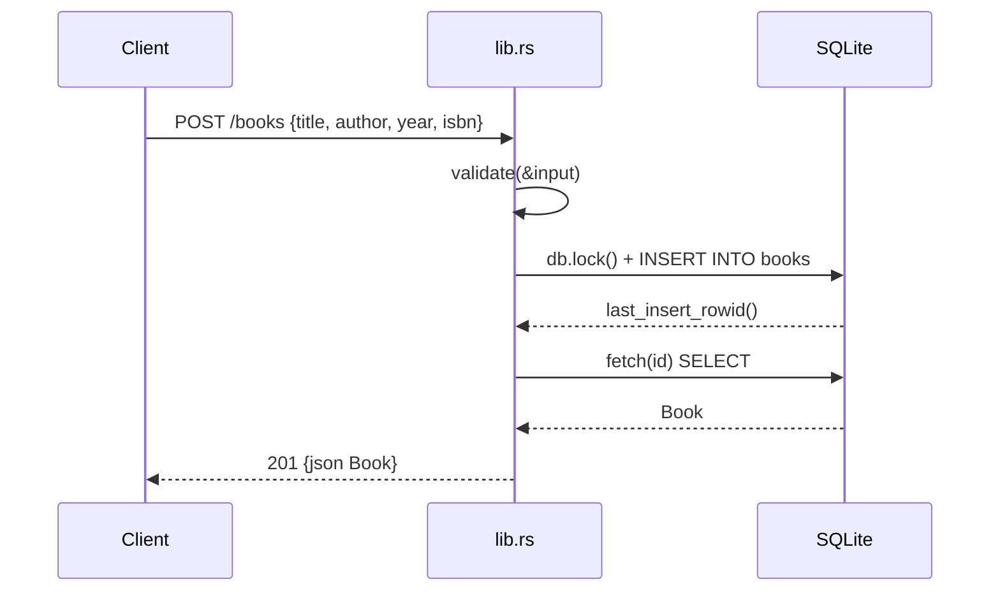

# Flow

A `POST /books` request deserializes the JSON body into `BookInput`, runs `validate` (trims and requires non-empty title and author, bounds year 0–9999, returning 400 with a details list on failure), acquires the `Mutex<Connection>`, inserts a row, re-fetches it by `last_insert_rowid()`, and returns 201 with the persisted `Book`. DB access is synchronous under a single global `Mutex` inside async handlers; `db.lock().unwrap()` will panic if the mutex is poisoned. Errors map through the `ApiError` enum to JSON with appropriate status codes.
