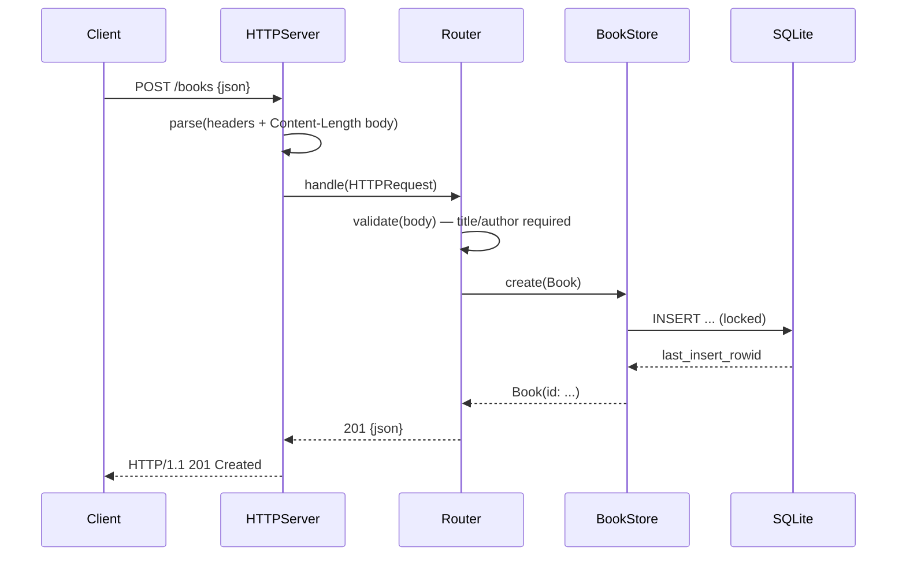

# Flow

A `POST /books` is buffered by `HTTPServer.receive` until headers and the full `Content-Length` body arrive, parsed into an `HTTPRequest`, and dispatched to `Router.handle`. The router decodes the JSON body into `BookInput`, trims and validates that `title` and `author` are non-empty (else 400), then calls `BookStore.create`, which inserts under an `NSLock` and returns the row id. The result is JSON-encoded (sorted keys) and returned as 201. The server is one-request-per-connection (`Connection: close`); all store access is serialized by a single lock. No pagination; author filter is exact-match (case-insensitive). Errors surface as JSON `{"error":...}` bodies with mapped status codes.
