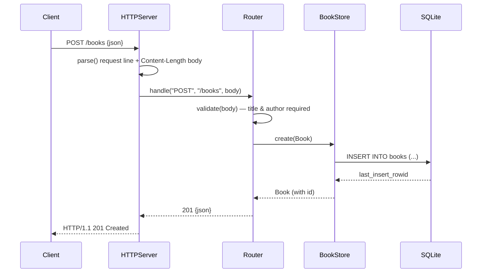

# Flow

A `POST /books` is read off the socket by `HTTPServer.parse`, which waits for the full body per `Content-Length`, then dispatched to `Router.handle`. The router decodes the JSON body, trims and checks that `title` and `author` are non-empty (returning 400 with an `errors` array otherwise), inserts via a prepared, parameter-bound statement in `BookStore`, and returns the persisted book (with its assigned id) as 201 JSON. Persistence is real SQLite; the store serializes access with an `NSLock`. The router is deliberately transport-independent, so all CRUD paths are exercised directly in tests without sockets, and one test additionally drives the live `HTTPServer` over `URLSession`.
