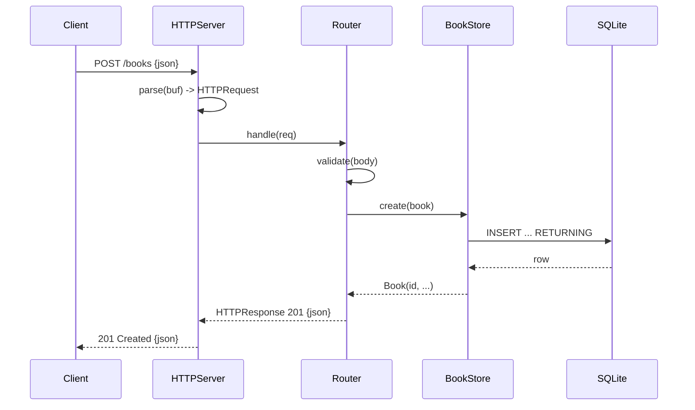

# Flow

A `POST /books` is read off the connection and parsed by `HTTPServer.parse` into an `HTTPRequest` (path, query, body). `Router.handle` matches the method/path, runs `validate` (title and author required and non-blank, year bounded 0–9999), and on success calls `BookStore.create`, which does a locked SQLite `INSERT ... RETURNING` and returns the persisted `Book`. The router encodes it as JSON with sorted keys and a `201` status; the server writes an HTTP/1.1 response and closes the connection. Validation failure returns `422`; malformed JSON returns `400`. The Router is transport-independent, so tests drive `handle` directly without opening a socket.
