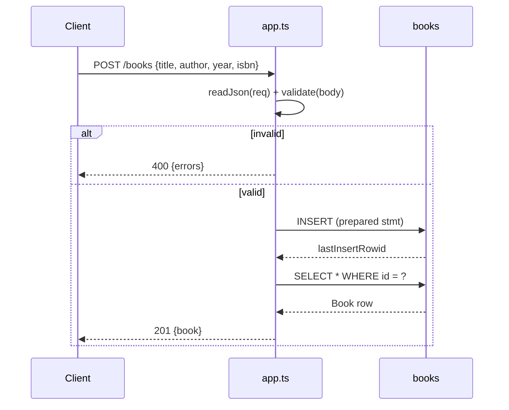

# Flow

A `POST /books` request is fully buffered by `readJson()` and parsed as JSON, then `validate()` trims and checks `title`/`author` (required) and the optional `year`/`isbn` types. On failure the handler returns `400` with an `errors` array; on success it inserts via a prepared statement, re-selects the row by `lastInsertRowid`, and returns it with `201`. All routes share one synchronous `node:sqlite` handle opened in `createApp()`. Notable: uses only Node built-ins (`node:http`, `node:sqlite`) with zero runtime dependencies; JSON parse errors are caught and mapped to `400`; the author filter is exact-match `COLLATE NOCASE` (not substring).
