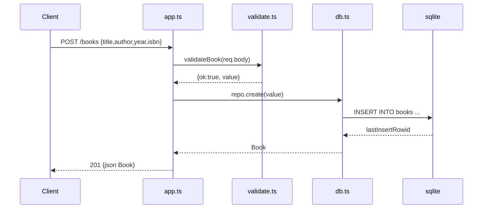

# Flow

A `POST /books` request is JSON-parsed by `express.json()`, then `validateBook` checks that `title` and `author` are non-empty strings and that `year`/`isbn` (if present) have the right type. On failure it returns 400 with an `errors[]` array. On success `BookRepository.create` runs a prepared `INSERT` against the `node:sqlite` database and re-reads the inserted row, which is returned as 201 JSON. Validation is centralized and reused by both POST and PUT; id parsing rejects non-positive/non-integer ids with 400; malformed JSON is handled by a dedicated error middleware.
