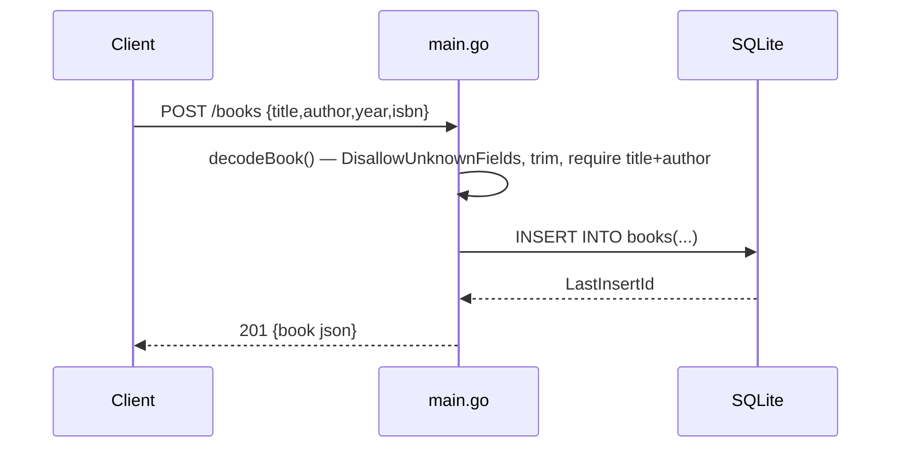

# Flow

A `POST /books` request is routed to `books`, which dispatches on method to `createBook`.
`decodeBook` decodes the body with `DisallowUnknownFields` and a 1 MiB `MaxBytesReader`,
rejects trailing content, trims `title`/`author`, and returns 400 if either is empty.
On success it `INSERT`s into the SQLite `books` table and returns the row with its
generated `id` as 201 JSON. Errors are uniformly serialized as `{"error": ...}` via
`writeError`. Input validation and per-request DB context are both present.
