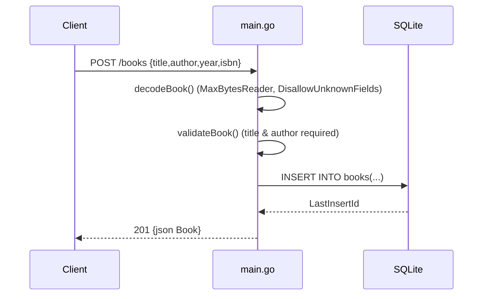

# Flow

A `POST /books` request is dispatched by `API.ServeHTTP`, decoded with a 1 MiB body cap and strict unknown-field rejection, validated (title and author must be non-blank after trimming), then inserted via a parameterized SQL statement. The new row id is read back and the created `Book` is returned as JSON with `201`. All handlers use parameterized queries; `db.SetMaxOpenConns(1)` serializes access to the SQLite connection.
