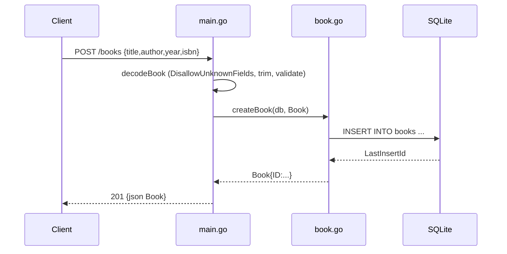

# Flow

A `POST /books` request is routed by `API.ServeHTTP` to `API.collection`, which calls `decodeBook`. `decodeBook` limits the body to 1 MiB, rejects unknown fields and multiple JSON objects, trims `title`/`author`, and returns `400` if either is blank. Valid input is inserted via `createBook`, which returns the row with its new autoincrement `ID`, serialized as JSON with `201 Created`. Errors return JSON `{error}` bodies with appropriate status codes. Validation, error handling, and SQLite-backed persistence are all present.
