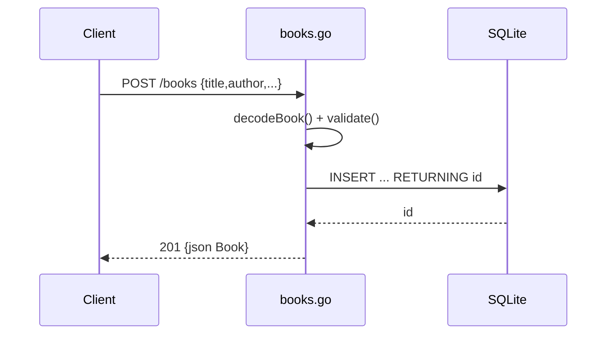

# Flow

A `POST /books` request is decoded with `DisallowUnknownFields` and a single-object guard, validated (title and author required, else 400), then inserted into SQLite using `INSERT ... RETURNING id` to fetch the new primary key in one round-trip. The populated `Book` is returned as JSON with 201. Reads (`GET /books`, `GET /books/{id}`) query the same table directly; the list route appends a `WHERE author = ?` clause when `?author=` is supplied. Errors are consistently emitted as `{"error": ...}` JSON with matching status codes. Persistence is real (file-backed SQLite via `modernc.org/sqlite`), not in-memory.
