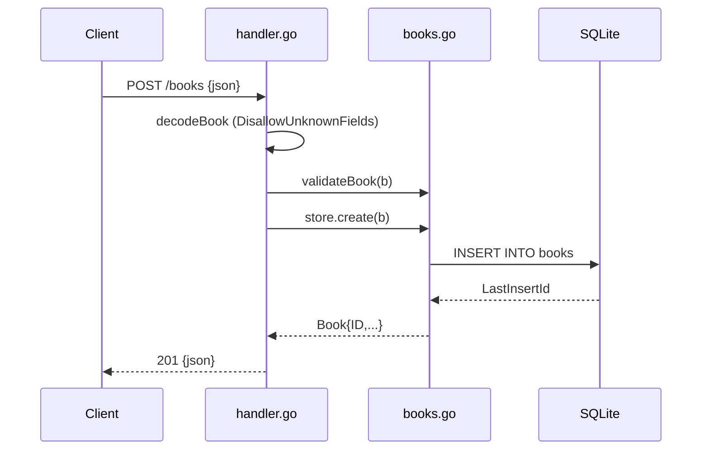

# Flow

A `POST /books` request is size-limited (1 MiB) and decoded with
`DisallowUnknownFields` plus a trailing-object check, so malformed or
multi-object bodies return `400`. `validateBook` rejects empty title/author
(`400`). Valid input is inserted via a parameterized SQLite statement and the
created row (with its generated `id`) is returned as JSON with `201`. Reads and
the `?author=` filter use `COLLATE NOCASE` case-insensitive matching; not-found
paths map `sql.ErrNoRows` to a `404`. Errors are consistently JSON-encoded.
