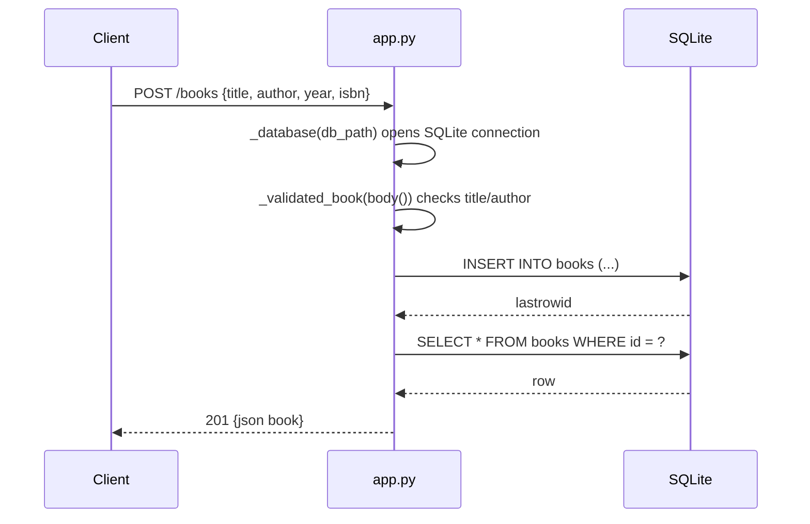

# Flow

A request enters the single WSGI `app` closure, which dispatches on `PATH_INFO` + `REQUEST_METHOD`. Each request opens a fresh SQLite connection through the `_database` context manager (which also runs `CREATE TABLE IF NOT EXISTS` on connect), so the schema is created lazily and every request is wrapped in an implicit transaction that commits on success. `POST /books` decodes the JSON body, validates that `title` and `author` are non-empty strings (and that `year`/`isbn` have the right types), inserts the row, then re-selects and returns the persisted record with `201`. Validation failures and malformed JSON are raised as `ValueError` and converted to `400`; unknown paths return `404`. Deviations from common patterns: no framework/router (manual regex path matching), a new DB connection per request rather than a pool, and PUT requires the full body (replace semantics, no partial update).
