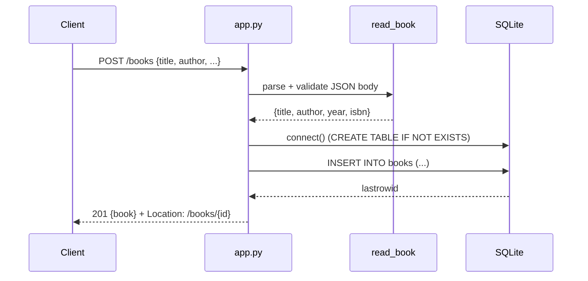

# Flow

A `POST /books` request is parsed and validated by `read_book`, which rejects a non-object body or a missing/blank `title` or `author` with a `ValueError` (mapped to 400). On success the handler opens a fresh SQLite connection per request (via `connect()`, which lazily creates the `books` table), inserts the row, and returns the created book with a `Location` header and 201. Each handler opens its own short-lived connection inside a `with` block; there is no connection pooling or migration layer. Validation covers required strings plus optional-type checks on `year` (int) and `isbn` (str).
