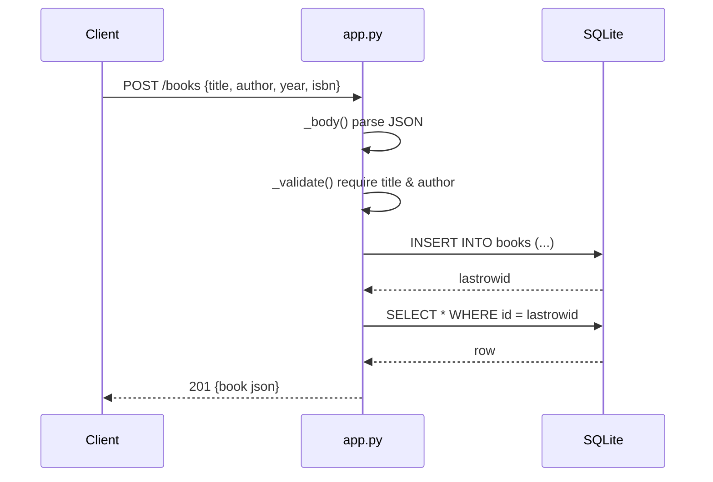

# Flow

A `POST /books` request is dispatched by `do_POST`, which reads the body with `_body()` (rejecting non-JSON / non-object bodies as `400`), enforces required `title`/`author` and optional-field types via `_validate()`, inserts the row through a fresh `sqlite3` connection, re-selects it to return the persisted representation with its generated `id`, and responds `201`. Each handler opens its own connection with `row_factory = sqlite3.Row`; there is no connection pooling. Routing is done by string-parsing `self.path`; `_book_id()` rejects non-`/books/{int>0}` paths as `404`. Notable: HTTP-level behavior (routing, status codes, JSON serialization) is exercised only via the live server, and the bundled tests call `_validate` and the schema directly rather than driving the routes, so the handler dispatch paths are not covered by the test suite.
