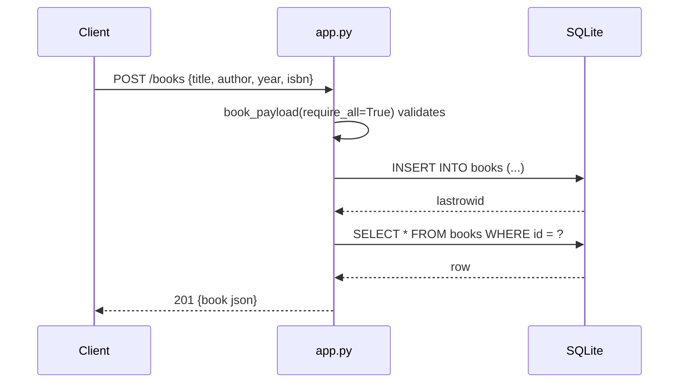

# Flow

A `POST /books` request is validated by `book_payload()`, which rejects non-object bodies, unknown fields, missing/blank `title` or `author`, and mis-typed `year`/`isbn` (all 400). On success a new row is inserted through a per-request `db_session()` context manager (one `sqlite3` connection opened and closed per call), and the freshly inserted row is re-selected and returned as JSON with 201. Reads and writes each open their own connection; there is no connection pooling or async handling, which is idiomatic for a small synchronous Flask service.
