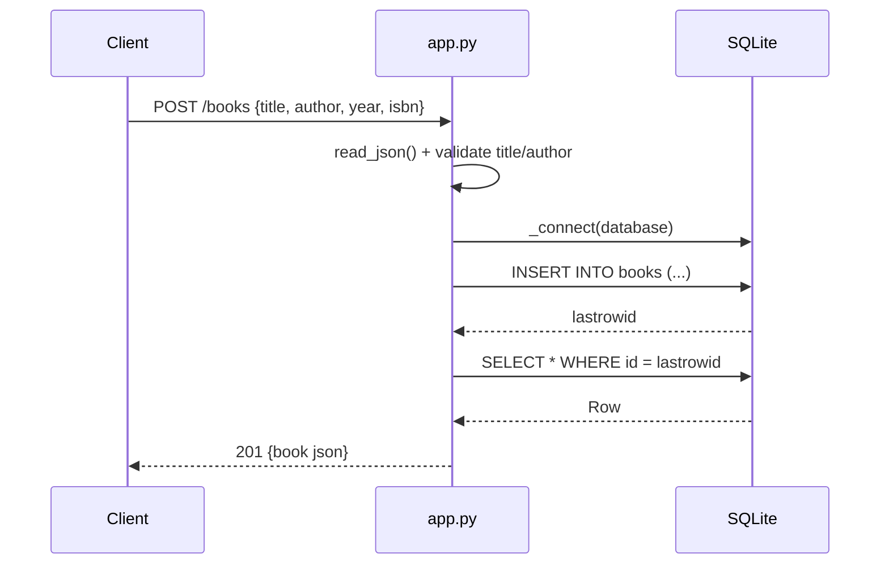

# Flow

A `POST /books` request reads and JSON-parses the body (`read_json`), rejecting a non-object body or a missing/blank `title` or `author` with `400`. On success it opens a fresh SQLite connection per request via `_connect` (which also lazily creates the `books` table), inserts the row, re-selects it by `lastrowid`, and returns `201` with the serialized book. Notable: a new SQLite connection is opened per request rather than reused; the `?author=` filter is exact-match only; there is no pagination.
