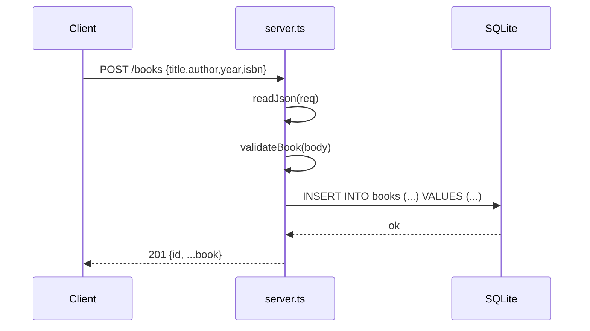

# Flow

A `POST /books` request is streamed and parsed by `readJson` (with a 1 MB cap and a 400 on malformed JSON), then `validateBook` enforces non-empty string `title`/`author`, an integer `year` in 0–9999, and a non-empty `isbn`, returning `400` on any violation. A valid book is assigned a `randomUUID()` id and inserted into the SQLite `books` table via a prepared statement, then returned as JSON with status `201`. All handlers are wrapped in a try/catch that maps thrown `status` errors to 4xx JSON and everything else to a logged `500`. Persistence uses the built-in `node:sqlite` `DatabaseSync` (file-backed by default, `:memory:` in tests).
