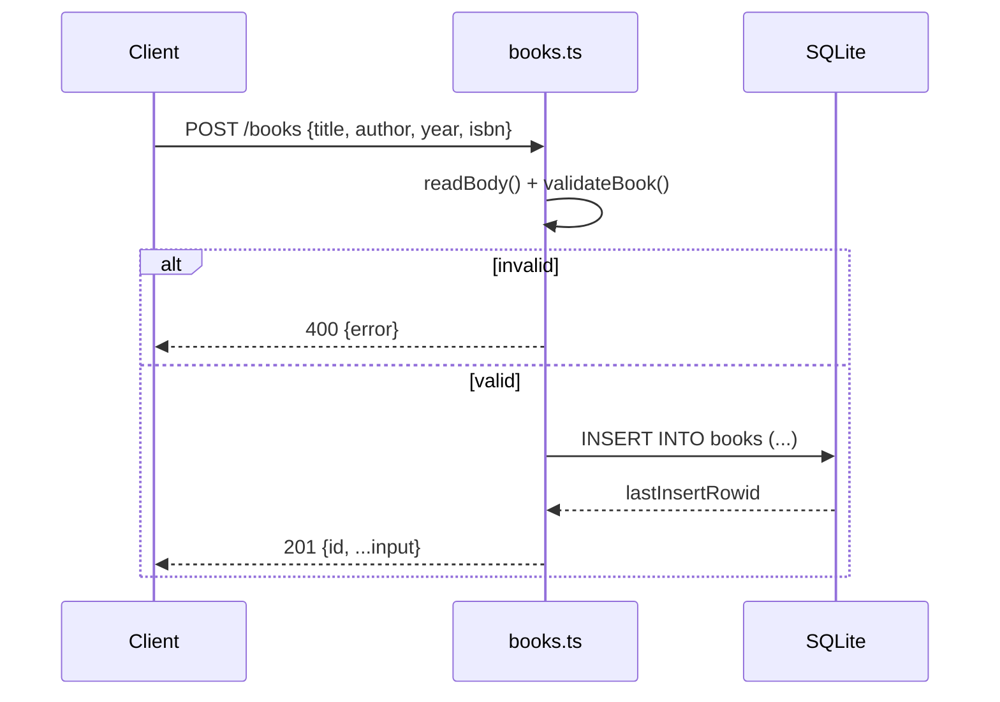

# Flow

A request to `POST /books` streams the body (capped at 1 MB), parses it as JSON, and runs `validateBook`, which trims and type-checks `title`/`author` (required), `year` (non-negative integer or null), and `isbn` (string or null). On failure it returns `400` with an error message; on success it inserts the row via a prepared `node:sqlite` statement and returns `201` with the new id. Persistence is real embedded SQLite (a file by default, `:memory:` in tests). Routing is manual string/regex matching on `pathname` + `method`; the id regex `^/books/([1-9]\d*)$` rejects non-positive/leading-zero ids at the routing layer. No auth, no pagination, no logging middleware.
