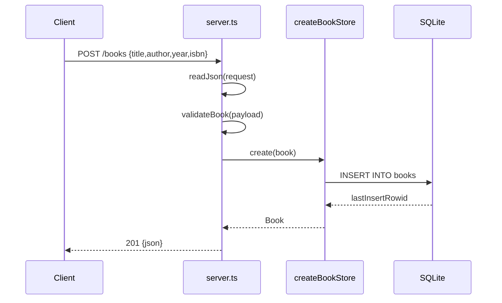

# Flow

A `POST /books` request is read (bounded to 1 MiB) and JSON-parsed, then `validateBook` requires non-empty string `title` and `author` and normalizes optional `year`/`isbn` (rejecting a bad type with `400`). On success the store prepares an `INSERT` against embedded `node:sqlite` and returns the freshly-selected row as `201` JSON. Routing is done with plain string/regex matching on a normalized path (trailing slash stripped); a shared error handler maps thrown `{status}` errors (413 oversized body, 400 bad JSON) and otherwise `500`. DELETE responds `204` via `sendJson` (which still writes a `content-type` header despite the empty body).
