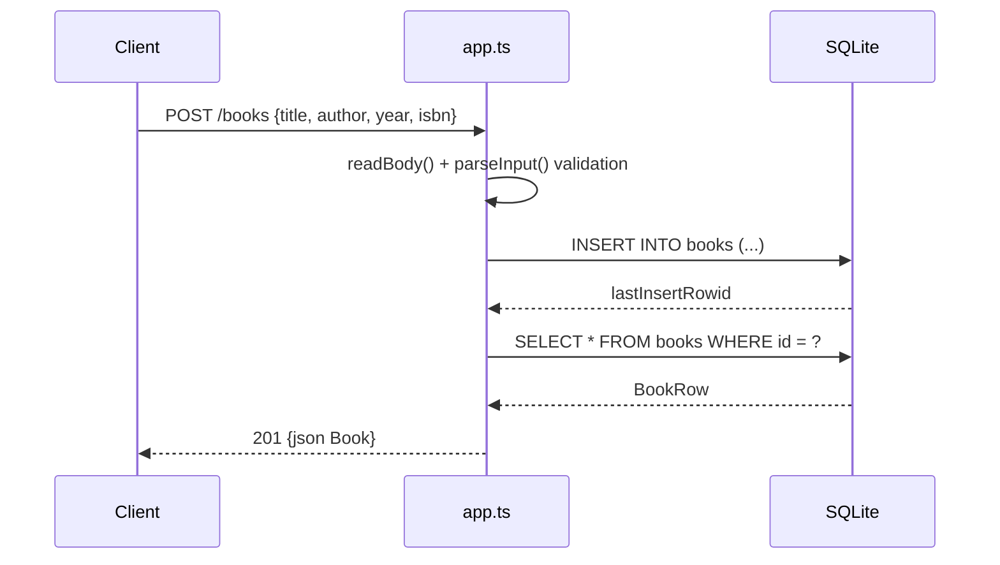

# Flow

A `POST /books` request is streamed and JSON-parsed by `readBody()`; malformed JSON yields `400`. `parseInput()` enforces that `title` and `author` are non-empty strings and that `year`/`isbn` (when present) have valid types, returning `400` with a specific message otherwise. Valid input is inserted with a prepared statement, then re-selected by `lastInsertRowid` and returned as `201`. Persistence uses `node:sqlite` `DatabaseSync` (embedded, file-backed by default; `:memory:` in tests). Validation, correct status codes, and top-level try/catch (`500` fallback) are all present; there is no pagination and the `?author=` filter is exact-match (case-insensitive) rather than substring.
