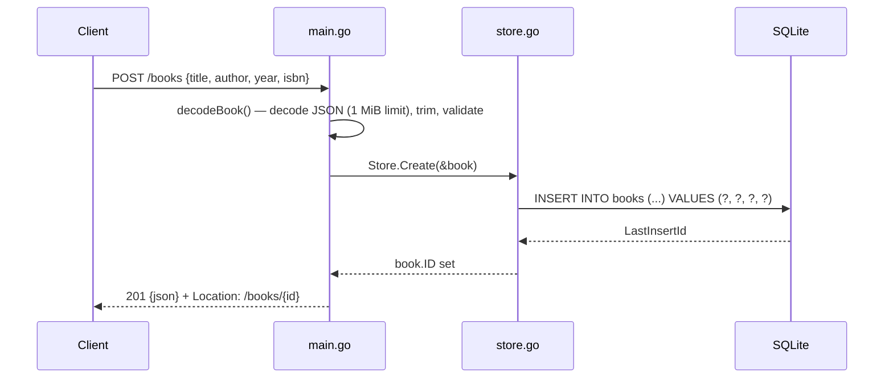

# Flow

A `POST /books` request is routed by the Go 1.22 method-pattern `http.ServeMux` to `server.create`. `decodeBook` reads at most 1 MiB of body, decodes it into a `Book`, trims `title` and `author`, and returns a message if either is empty or `year` is negative; the handler turns that message into a `400` JSON error. Otherwise `Store.Create` runs a parameterized `INSERT` through `database/sql` on the `modernc.org/sqlite` driver and fills in the new row ID, and the handler responds `201` with the book as JSON and a `Location` header.

Deviations from common patterns: no web framework (standard library only); the DB pool is pinned to a single connection (`SetMaxOpenConns(1)`); handlers do not pass the request context to the store; `PUT` reuses the create validation and replaces every column; unknown JSON fields are accepted; `isbn` is not validated.
