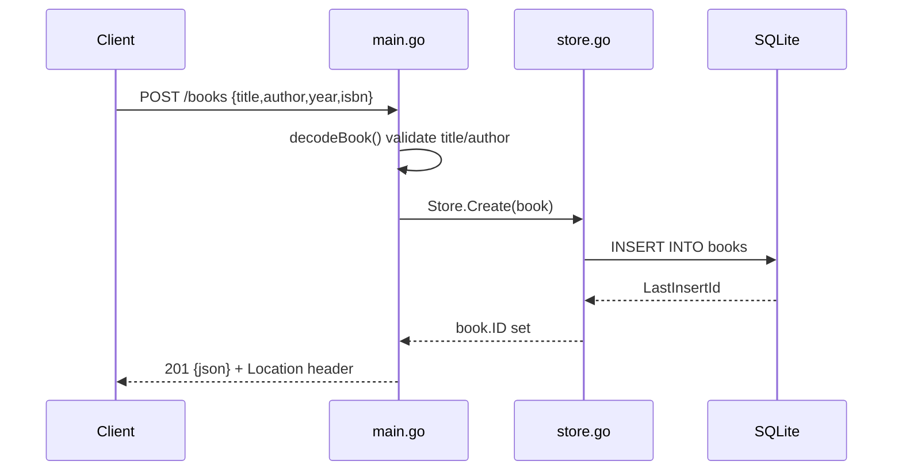

# Flow

A `POST /books` decodes the JSON body (capped at 1 MiB), trims and validates that `title` and `author` are non-empty and `year` is non-negative, then inserts a row via `Store.Create`, which fills in the generated ID. The handler responds 201 with the created book and a `Location` header. Validation failures return 400; storage errors are mapped through `server.fail` to 404 (`errNotFound`) or 500. The store forces a single open connection so an in-memory (`:memory:`) database stays consistent and writes serialise.
