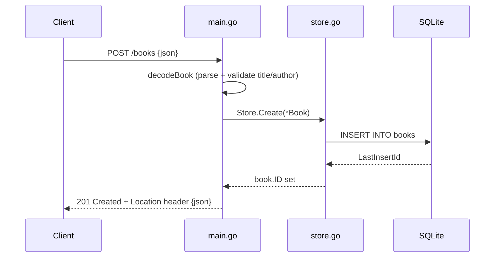

# Flow

A `POST /books` request is decoded by `decodeBook`, which caps the body at 1 MiB, trims fields, and rejects a missing title/author or negative year with `400`. On success `Store.Create` inserts the row and back-fills the generated `ID`; the handler sets a `Location` header and returns `201` with the JSON book. Errors from the store are mapped by `serverErr` — `errNotFound` → `404`, anything else → logged and `500`. Persistence is SQLite through `database/sql` with a single open connection to serialise writes and keep `:memory:` databases consistent in tests.
