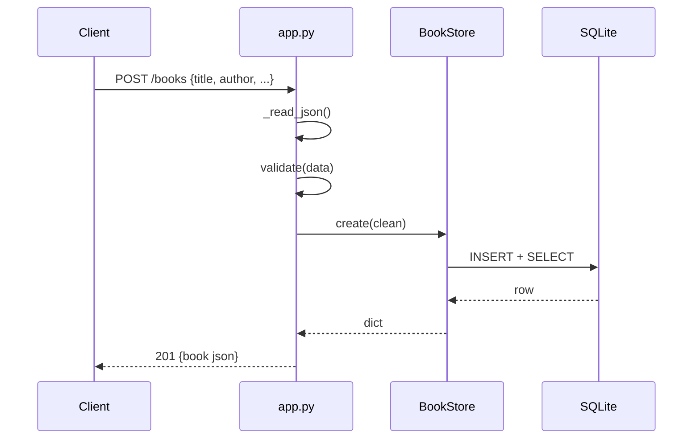

# Flow

A `POST /books` request reads the JSON body, runs `validate()` (rejecting missing/blank `title`/`author`, non-int `year`, non-str `isbn` with a 400 and error details), then `BookStore.create()` inserts the row under a lock and reads it back so the response carries the assigned `id`. Data access is synchronous and serialized through a single `threading.Lock`, sharing one SQLite connection across the `ThreadingHTTPServer` worker threads (`check_same_thread=False`). No pagination on list; `?author=` is an exact-match filter. `PUT` performs a full replacement and re-validates.
