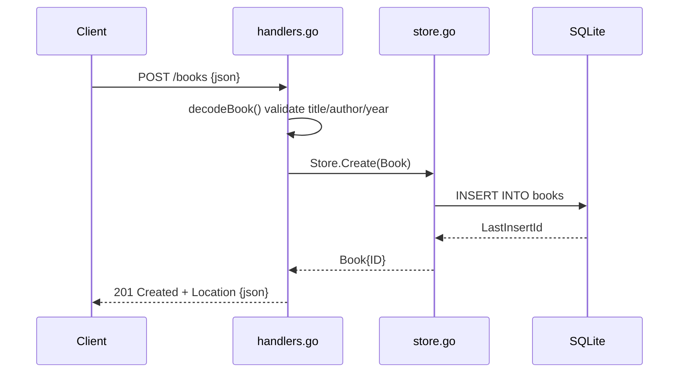

# Flow

A `POST /books` request is decoded by `decodeBook()`, which limits the body to 1 MiB, rejects unknown fields and trailing data, trims whitespace, and requires a non-blank title and author with a non-negative year. On success the handler calls `Store.Create`, which inserts a row and returns the book with its generated ID; the handler responds `201 Created` with a `Location` header and the JSON body. Validation failures return `400` with an `{"error"}` body; store failures are logged and returned as `500`. Error handling and input validation are present throughout.
