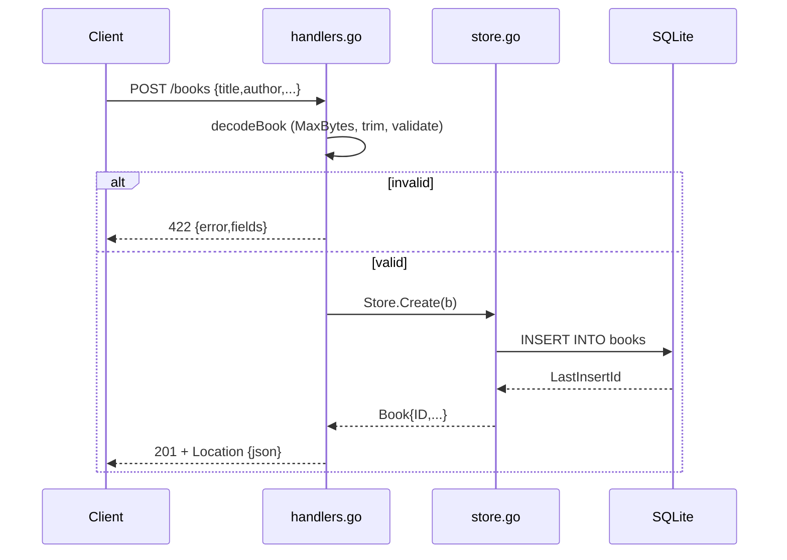

# Flow

A `POST /books` request is size-capped (1 MiB via `http.MaxBytesReader`), JSON-decoded with strict trailing-data rejection, and validated: `title`/`author` must be non-blank and `year` in 0–9999, else `422` with a `fields` map. Valid input is inserted into SQLite and returned as `201` with a `Location` header. Notable: validation failures return `422 Unprocessable Entity` rather than `400`; a single DB connection (`SetMaxOpenConns(1)`) serialises writes; graceful shutdown on SIGINT/SIGTERM.
