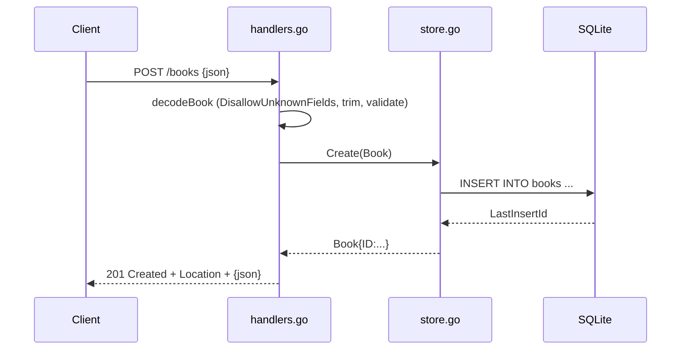

# Flow

A `POST /books` request is size-capped (`http.MaxBytesReader`, 1 MiB) and decoded with `DisallowUnknownFields`; a decode error returns 400. The body is then validated (title and author required after trimming, year non-negative) — a validation failure returns 422. On success `Store.Create` inserts the row on a single-connection SQLite DB and the handler returns 201 with a `Location` header and the persisted book as JSON. Errors from the store surface as a logged 500. Note: validation failures use 422 (Unprocessable Entity) rather than 400; input is validated before the DB is touched.
