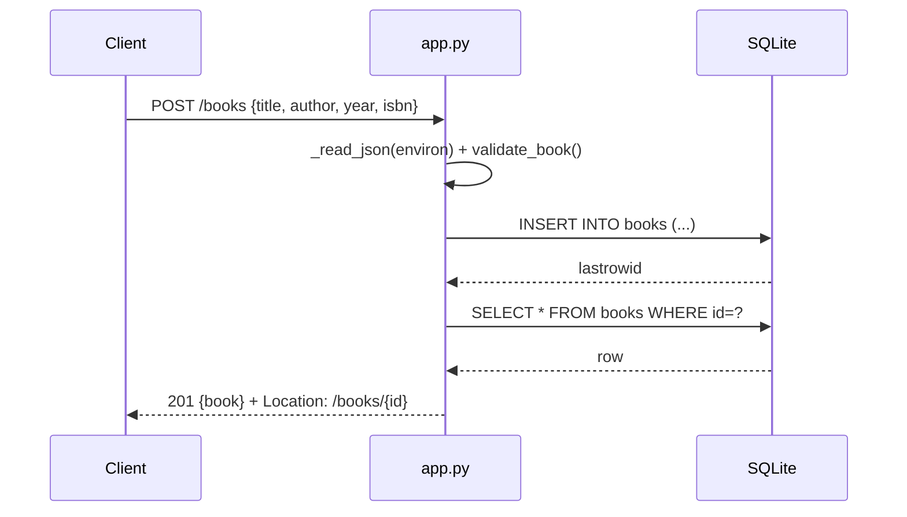

# Flow

A `POST /books` reads and JSON-decodes the body (rejecting empty, malformed, or oversized bodies), runs `validate_book()` which aggregates every field error into a single `400` with a `details` map, then inserts the row inside a transaction (`_run` opens a per-request connection, or reuses the shared connection for `:memory:`) and re-selects it so the response carries the DB-assigned `id`. Errors are funneled through a single `HTTPError` handler in `__call__`; a bare `except` maps anything unexpected to `500`. Notable: pure standard library (WSGI + `sqlite3`), no framework; PUT does a full-record replacement rather than a partial patch; author filter is an exact `COLLATE NOCASE` match, not a substring search.
