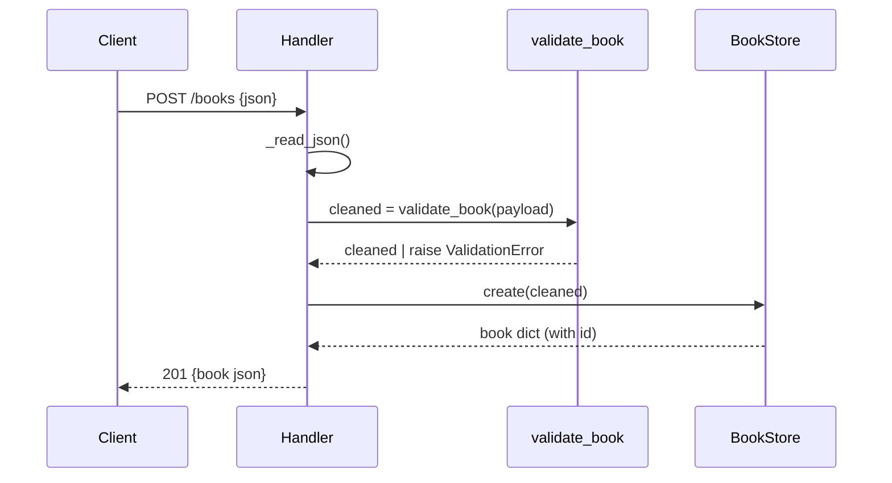

# Flow

A request is dispatched by `Handler._dispatch`, which routes on path and method.
For `POST /books` the handler reads the body via `_read_json` (bounded by
`MAX_BODY`), passes it through `validate_book` (title/author required non-empty
strings; year must be int; isbn must be string), then inserts via a lock-guarded
SQLite connection in `BookStore.create` and returns 201 with the persisted row.
A `ValidationError` anywhere is caught in `_handle` and returned as 400 with a
per-field `details` object; any other exception becomes a 500. Storage is a
single `sqlite3` connection shared across threads and serialized by a
`threading.Lock`.
