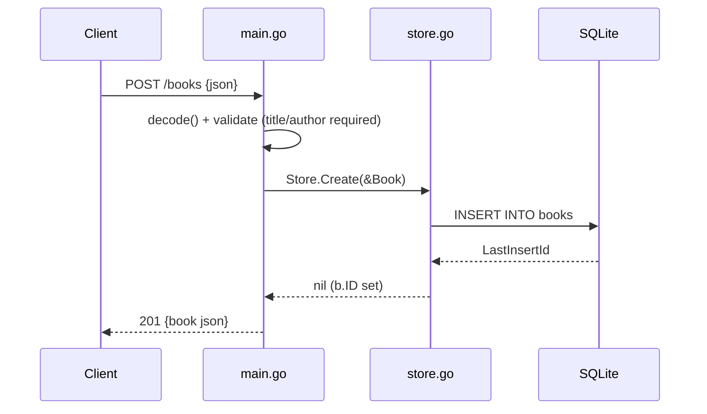

# Flow

A `POST /books` request is decoded by `decode()`, which caps the body at 1 MiB, trims `title`/`author`, and rejects empty title, empty author, or negative year with a 400. The validated `Book` is inserted via `Store.Create`, which sets the generated `ID`, and the created book is returned as `201`. Missing-row updates/deletes are surfaced as `sql.ErrNoRows` and mapped to `404` by `server.fail`; other DB errors are logged and returned as `500`. `SetMaxOpenConns(1)` serializes access so an in-memory DB stays consistent.
