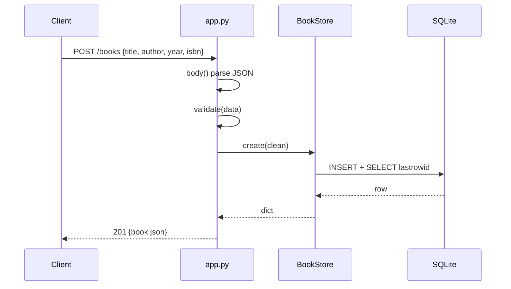

# Flow

A `POST /books` reads the body via `_body()`, runs `validate()` (title/author required non-empty strings; year must be int; isbn must be a string), then `BookStore.create()` inserts the row under a `threading.Lock` and re-selects it by `lastrowid`. The response is JSON with a `Content-Type: application/json` header and status 201. All store operations serialize on a single lock; `check_same_thread=False` lets the `ThreadingHTTPServer` share one connection.
