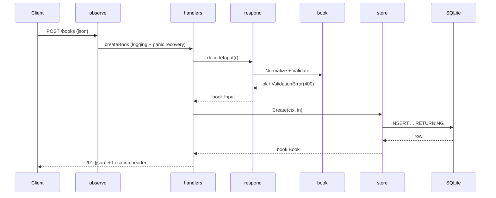

# Flow

A `POST /books` request enters through the `observe` middleware (request logging and panic-to-500 recovery), then `createBook`. The body is size-limited (1 MiB), decoded as exactly one JSON object, normalized, and validated (`title` and `author` required); a validation failure returns `400` with per-field details. On success the store issues an `INSERT ... RETURNING`, and the handler responds `201` with the created book and a `Location` header. Errors from the store are mapped centrally by `fail`: `book.ErrNotFound` → `404`, anything else → a generic logged `500` (the cause is never leaked to the client). The store uses a single SQLite connection (`SetMaxOpenConns(1)`) with WAL and a busy timeout, so writes are serialized and `:memory:` databases stay coherent. Notable strengths beyond the typical pattern: graceful shutdown of in-flight requests, health check that actually pings the DB, and 405-with-`Allow` for wrong methods.
