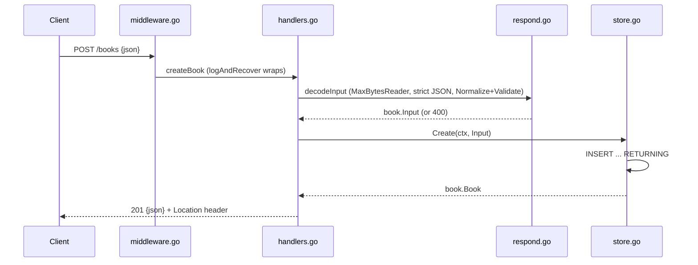

# Flow

A `POST /books` request passes through `logAndRecover` (request logging + panic→JSON 500), then `createBook` calls `decodeInput`, which caps the body at 1 MiB, decodes exactly one JSON object (rejecting trailing data), normalizes whitespace, and validates that title and author are present and well-formed. On success the SQLite store inserts the row and returns it via `RETURNING`, and the handler responds `201` with a `Location` header. Validation failures return `400` with per-field `details`; unknown IDs on the get/update/delete paths map to `404` via `storeError`. Error handling is thorough: client disconnects map to a non-logged 499, and all other store errors become a logged generic 500 without leaking internals.
