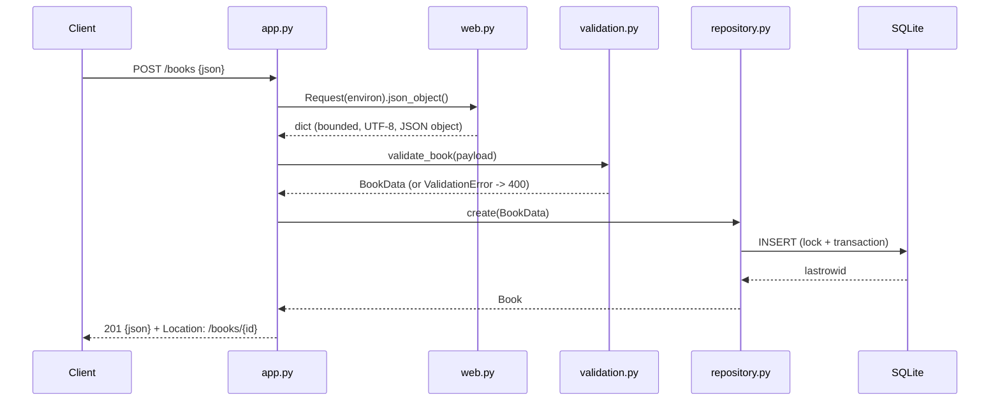

# Flow

A `POST /books` request is wrapped in a `Request` that reads a length-bounded (<=1 MiB), UTF-8
body and parses it as a JSON object. `validate_book` checks/normalises the fields, raising
`ValidationError` (mapped to a 400 with a per-field `details` map) on any problem. Valid data is
inserted through the lock-guarded shared SQLite connection in `BookRepository.create`, and the
stored `Book` is serialised to JSON with a 201 and a `Location` header.

Deviations / notable behaviours worth flagging for comparison: the layering is unusually thorough
for this task — dedicated `models`/`validation`/`repository`/`web`/`app`/`server` modules, all
standard-library only (no Flask/Django). Errors always return JSON (even protocol errors from the
HTTP layer, via `RequestHandler.send_error`). Extras beyond the spec: OPTIONS/HEAD support with
`Allow` headers, request-body size and chunked-encoding limits, latin-1→UTF-8 query repair, log
control-character escaping, SIGTERM-clean shutdown, a thread-safe single-connection design that
keeps `:memory:` DBs working, and CHECK constraints as a defence-in-depth net behind validation.
No pagination on list; PUT is a full replace (all fields required again).
