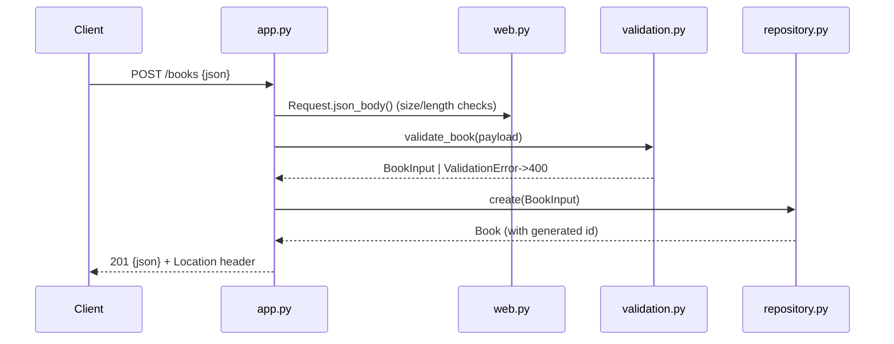

# Flow

A `POST /books` request is wrapped in a `Request`, whose `json_body()` enforces `Content-Length` (rejecting chunked or oversized bodies) before decoding JSON. The payload is validated by `validate_book()` — `title`/`author` required, `year`/`isbn` optional, control characters and non-storable Unicode rejected, all errors reported together as a 400. On success the `BookRepository` inserts a row under a lock (single shared autocommit connection) and returns the `Book` with its AUTOINCREMENT id, serialised as 201 JSON with a `Location` header. Notable deviations from a minimal implementation: full input validation, request-size limits, Unicode-aware author filtering (`fold()`), HEAD handling, and threaded serving with per-connection timeouts.
