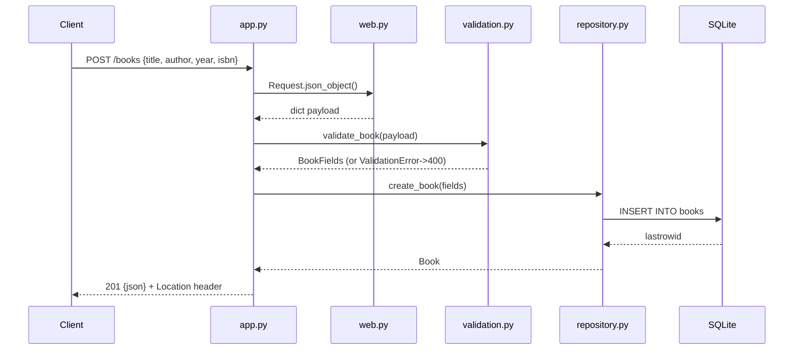

# Flow

A `POST /books` request is parsed by `web.py:Request.json_object()` (which enforces Content-Length, a 64 KiB body cap, and UTF-8 JSON-object shape), validated by `validation.py:validate_book()` (title/author required, per-field errors aggregated, year range and text-length/control-char checks), then persisted through `repository.py:BookRepository.create_book()` under a threading lock on a shared SQLite connection. The handler returns `201` with the created book as JSON and a `Location` header. Errors are funnelled through `HTTPError`/`ValidationError` into JSON bodies with correct status codes; a catch-all logs and returns `500`. Notable: full input validation and error handling present; author filter is case- and Unicode-normalisation-insensitive; server is threaded with per-request timeouts.
