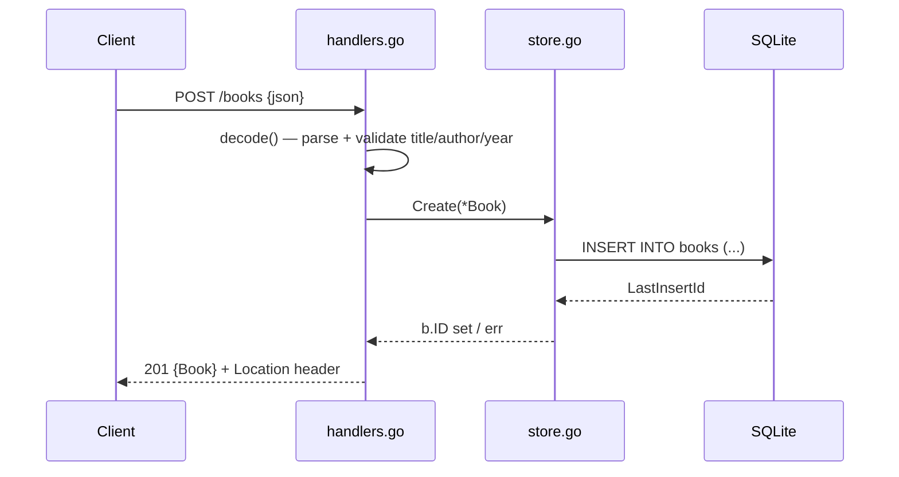

# Flow

A `POST /books` request is decoded and validated by `decode()`: the body is capped at 1 MiB, JSON is parsed into a `Book`, `title`/`author`/`isbn` are trimmed, and empty title, empty author, or negative year each yield a `400`. On success the handler zeroes any client-supplied ID and calls `Store.Create`, which runs a parameterized `INSERT` and reads back the auto-increment ID. The handler sets a `Location` header and returns `201` with the created book as JSON. Store errors are routed through `api.fail`, which maps `errNotFound` to `404` and everything else to a logged `500`. Input validation, parameterized queries, and per-request body size limits are all present; the SQLite pool is deliberately capped to one connection to keep `:memory:` databases consistent and avoid write locks.
