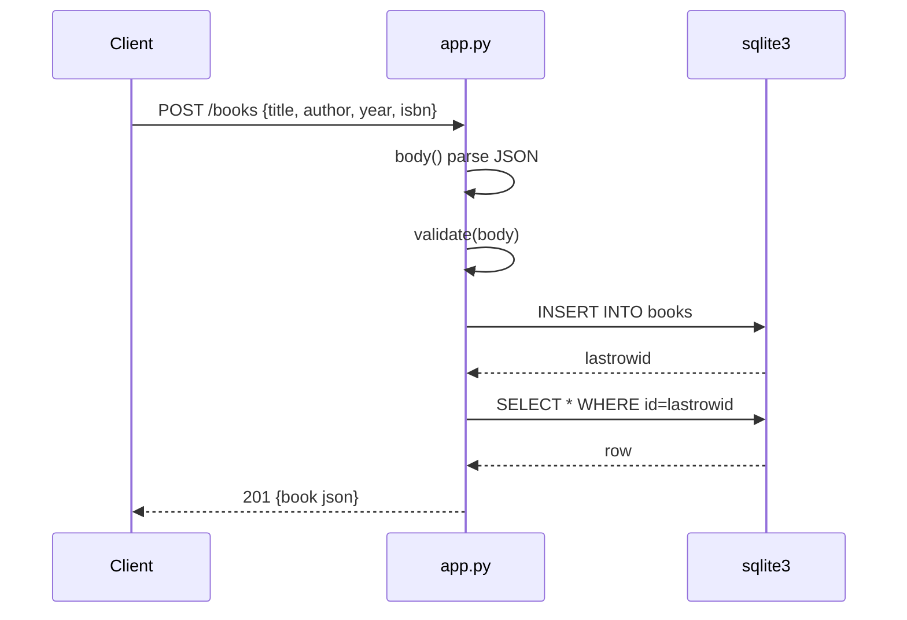

# Flow

A `POST /books` request is dispatched by `app()`, which reads and JSON-parses the request body (`body()`), validates that `title`/`author` are non-empty strings and that `year`/`isbn` have correct types (`validate`), inserts the row into the shared SQLite connection, then re-selects the created row and returns it as JSON with `201 Created`. Validation failures and JSON parse errors are raised as `HTTPError` and rendered as `{"error": ...}` with a `400` status; missing books yield `404`. The server is single-connection stdlib WSGI (`wsgiref.simple_server`); no async, no pagination.
