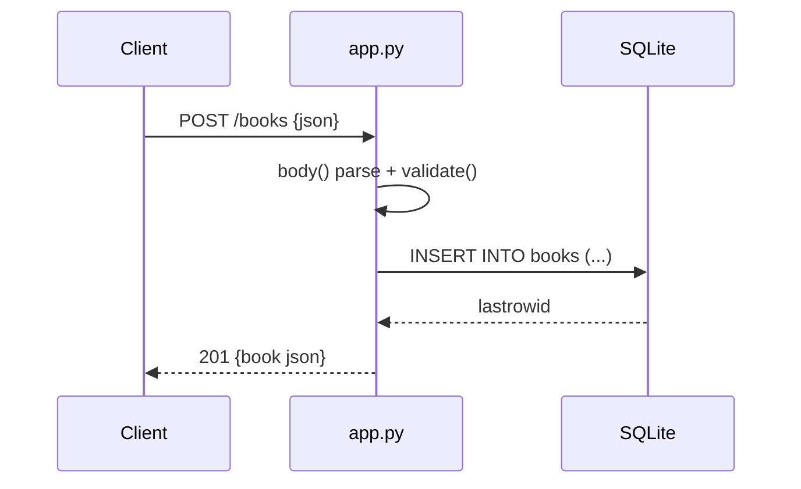

# Flow

A `POST /books` request is parsed by the inner `body()` closure (JSON decode, raising `ValidationError` → 400 on bad JSON), then `validate()` enforces that `title` and `author` are non-empty strings and that `year`/`isbn` have the right types. On success the row is inserted, committed, and returned with its new `id` as 201 JSON. A single shared connection is created per `create_app()` call and reused across requests (synchronous, no pooling); the schema is created lazily in `connect()`.
