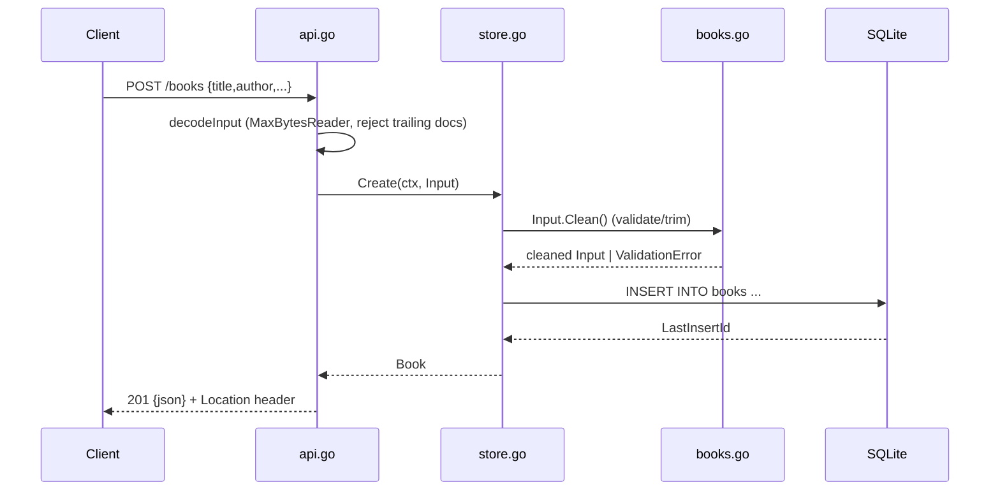

# Flow

A `POST /books` request is size-capped and JSON-decoded (rejecting malformed bodies, wrong-typed fields, and trailing documents), then `Store.Create` calls `Input.Clean` to trim and validate — title and author are required, with length/range bounds — before a parameterized `INSERT`. On success the new `Book` is returned as 201 JSON with a `Location` header. Validation failures map to a 400 with a per-field `fields` object; not-found maps to 404; a panic anywhere is recovered into a 500 JSON error by middleware. SQLite access is serialized on a single connection so `:memory:` (used by tests) and file databases behave identically.
