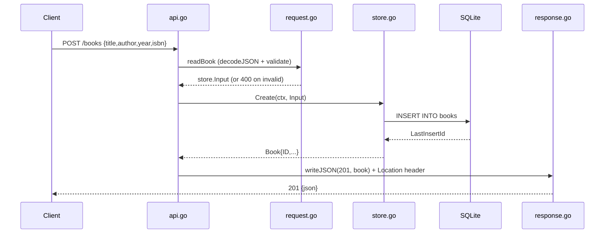

# Flow

A `POST /books` request is size-limited (1 MiB) and JSON-decoded by
`decodeJSON`, which rejects malformed bodies, wrong field types, and trailing
data with specific 400 messages. `bookRequest.validate` trims fields and
enforces required `title`/`author`, length caps, and a year range, returning a
per-field `details` map on failure. Valid input is persisted via
`store.Create` (parameterized SQL) and the created book is returned as `201`
with a `Location` header. All handlers are wrapped by panic-recovery and
request-logging middleware; store errors map to `404` (not-found) or a
detail-hiding `500`.
