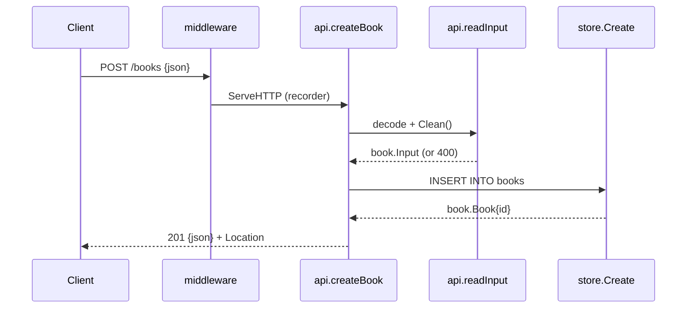

# Flow

A `POST /books` request passes through the logging/panic-recovery middleware, then `createBook` decodes the JSON body (bounded to 1 MiB, single-object enforced) and runs `Input.Clean()`, which trims fields and rejects a missing title/author or out-of-range year/isbn with a structured `400`. On success the store inserts a row via a parameterized query and returns the book with its assigned id; the handler sets a `Location` header and writes `201`. Store failures map to `500` (internal detail logged, never leaked); a missing id on get/update/delete maps to `404`. Notable: uses Go 1.22+ method-aware `ServeMux` patterns, a pure-Go SQLite driver, WAL mode for on-disk DBs, and explicit `405`/`Allow` handling.
